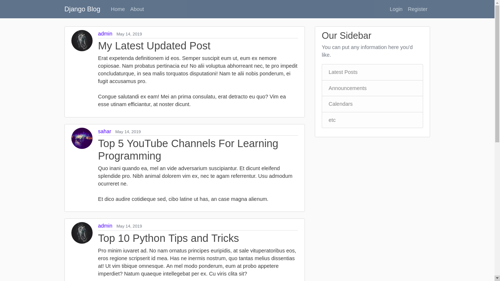
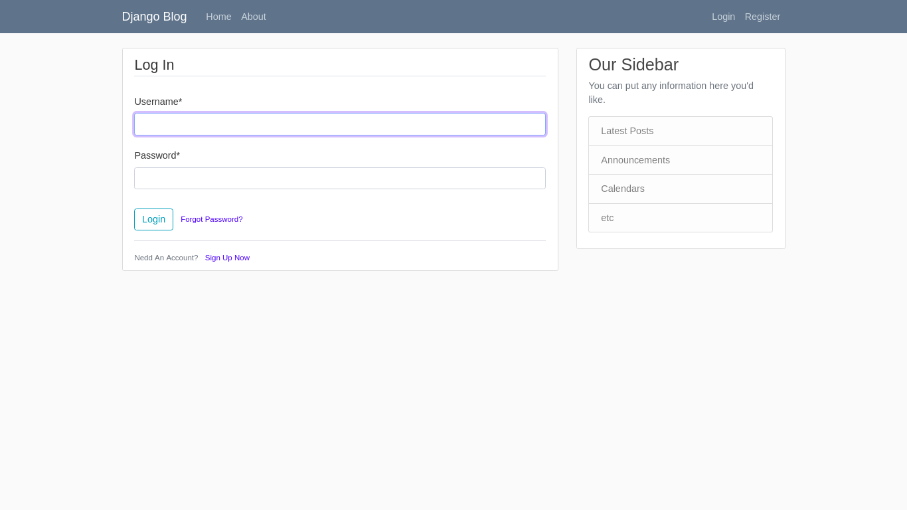
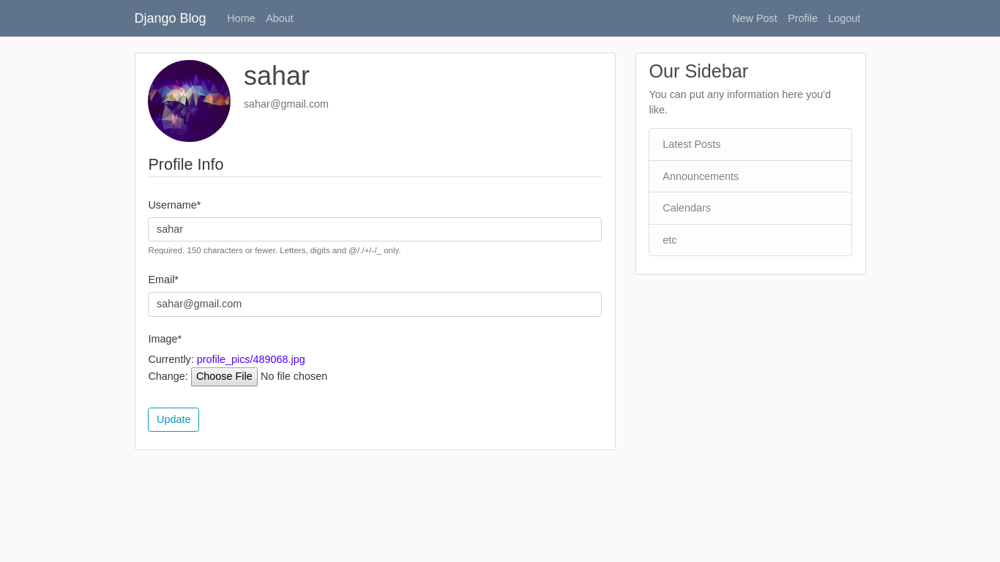
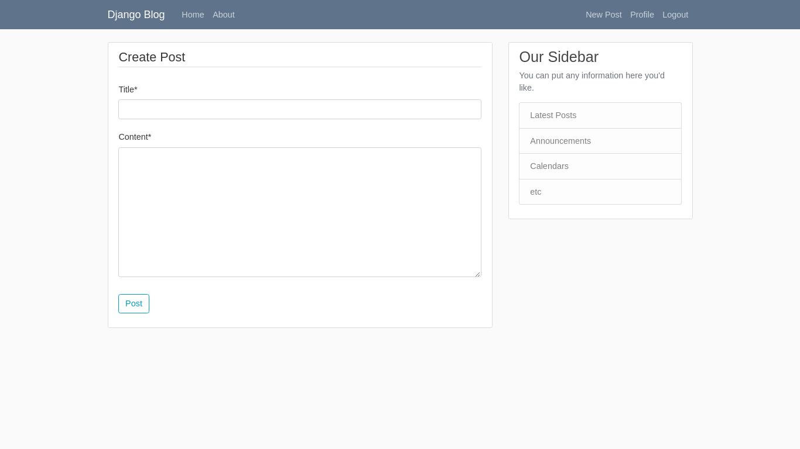

# Django Blog
[](https://python.org/downloads/)
[](https://djangoproject.com/)
[](https://choosealicense.com/licenses/mit/)

Full-Featured Blog with djnago web framework. 

Screenshots
=



Features 
=
- User Registration
- User Login & Logout
- User Profile
- Create, Update & Delete Posts
- Password Reset


How to use
= 
## Clone project & Install Requiremenets
```
git clone https://github.com/pubuser7/django-blog.git && cd django-blog
pip3 install requirements.txt
```

## Migrate & Run Server
```
cd src && python3 manage.py migrate
python3 manage.py runserver
```
Enter in your browser http://localhost:8000/

## Create Admin user
```
python3 manage.py createsuperuser
```
Login into https://localhost:8000/admin/

## Add Some Fake Posts
First create 2 another user from admin panel or blog.
```
python3 add_fake_posts.py
```
Run server and see demo.


TODOS
=
- User Change Password
- Search
- Comments
- Change Style
- More Options For New Post
- Sidebar
- ...
